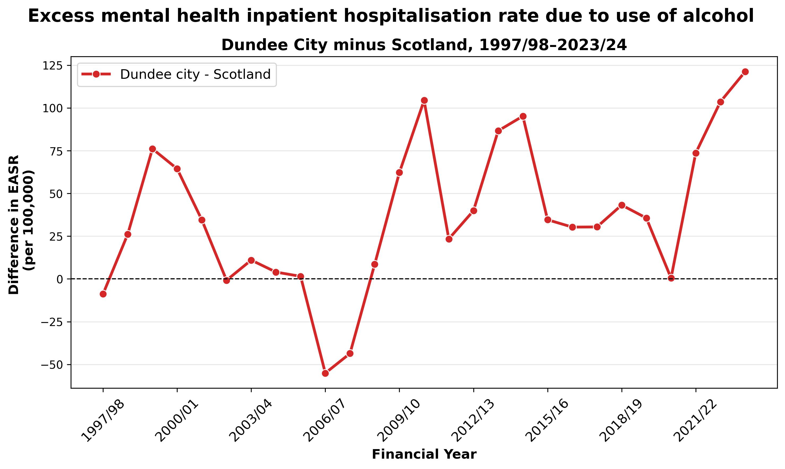
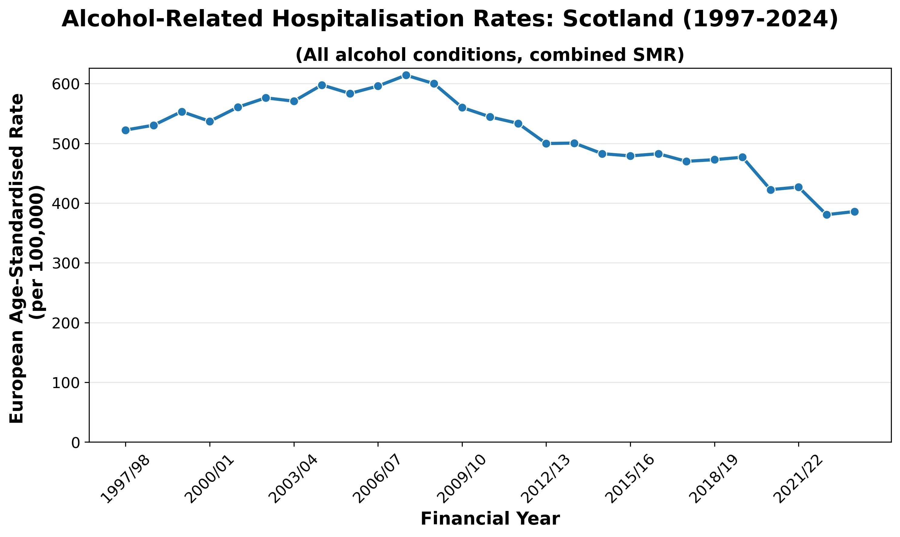
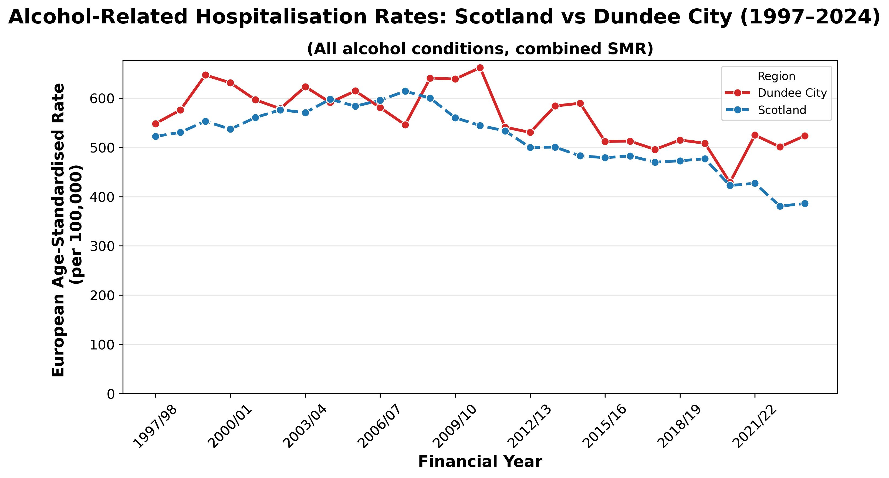
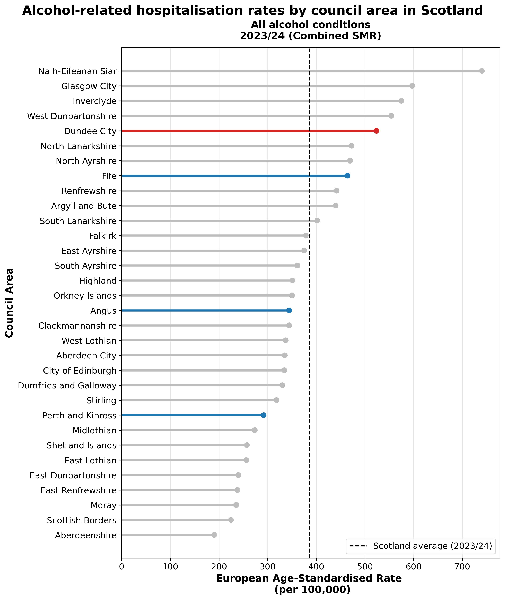

# Alcohol‑Related Hospital Statistics in Scotland (ARHS)

[](https://app.powerbi.com/view?r=eyJrIjoiM2UxNGM3YjItNDBmNS00NGI4LTg5MTMtZTNlMDJjZmVlOGVkIiwidCI6IjZjODBiOWI3LTM4ZTktNDNmOS05YTllLWM3NTVhNTg5MzllNyJ9)

## Background

Alcohol‑related harm remains a major public health issue in Scotland, with substantial variation between local authority areas. Hospital admission data provide an important lens for examining long‑term trends and geographic inequalities in alcohol‑related harm.

This project analyses **alcohol‑related hospital statistics (ARHS)** using routinely published Scottish health data. The focus is on **how alcohol-related hospitalisation rates change over time**, **how local authorities compare with the national average**, and **where inequalities are most pronounced**, with Dundee City used as a case study.

---

## Key visual insight

### Alcohol-related hospitalisation gap: Dundee City vs Scotland

This figure shows the difference in European Age-Standardised Rates (Dundee City minus Scotland). Values above zero indicate excess burden in Dundee.



Dundee City consistently experiences higher alcohol-related hospitalisation rates
than the Scottish average. The gap persists over time, indicating a sustained
inequality rather than short-term fluctuation.

---

## Aim

The aims of this project are to:

- Clean and standardise a **real‑world public health dataset** in a transparent, reproducible way
- Explore national and local trends in alcohol‑related hospitalisation rates
- Quantify inequalities between council areas and the Scottish average
- Present results clearly using both static and interactive visualisations

The analysis is **descriptive** and does not attempt to infer causality.

---

## Data

The raw dataset, ARHS_byCouncilArea.csv, comes from publicly available Scottish health statistics and reports annual alcohol‑related hospital statistics between 1997 and 2024 and is broken down by:

- Council area (local authority)
- Financial year
- Alcohol‑related condition category
- Measure type (e.g. stays, patients)

Rates are reported as **European Age‑Standardised Rates (EASR) per 100,000 population**, allowing comparison across areas and over time.

Only minimal cleaning is performed in order to preserve the original structure and meaning of the data.

---

## Tools used

This project combines **Python-based analysis** with a **Power BI dashboard**. Python is used for data cleaning, validation, and analytical logic, while Power BI is used for interactive visualisation and stakeholder-facing reporting.

- **Jupyter notebooks** for reproducible workflows
- **Python libraries**
  - **pandas, numpy** for data cleaning and analysis
  - **matplotlib, seaborn** for exploratory figures
- **Power BI** for interactive dashboards
- *(Optional extension)* ArcGIS for spatial visualisation

The two components are deliberately separated but fully aligned: **Power BI only consumes the cleaned dataset produced by the Python pipeline**.

---

## Analysis process

### 1. Data cleaning

The first notebook prepares a clean, analysis‑ready dataset:

- Standardises column names and data types
- Converts coded fields into readable labels
- Extracts numeric financial years
- Checks for missing values and duplicate records
- Drops columns which are not needed for downstream analysis

The output is a single cleaned CSV file, ARHS_byCouncilArea_clean.csv, used by all downstream analysis and visualisation.

---

### 2. Exploratory data analysis (EDA)

The second notebook focuses on describing patterns in the data:

- National time‑series trends for Scotland
- Comparisons between Dundee City and the national average
- Condition‑specific trends over time
- Identifies conditions contributing most to observed gaps

This stage is **purely descriptive** and does not frame results as inequalities.

---

### 3. Inequality analysis

The third notebook explicitly examines inequality relative to Scotland:

- Calculates differences between local authority rates and the national average
- Ranks councils by excess or deficit burden
- Identify conditions driving inequality

This separation keeps descriptive analysis and inequality analysis conceptually clear.

---

## Key insights

- Alcohol‑related hospitalisation rates vary substantially over time and between council areas.
- Dundee City consistently records higher alcohol-related hospitalisation rates than the Scottish average.
- The gap between Dundee City and Scotland is persistent rather than driven by a single year.
- Mental and behavioural disorders due to alcohol account for a large share of the excess burden in Dundee City.
- In the most recent year of data, Dundee City ranks among the councils with the highest excess alcohol-related hospitalisation rates relative to Scotland.

All findings are **descriptive** and intended to highlight patterns rather than explain causes.

---

## Selected visual outputs

The figures below illustrate the main analytical findings. Interactive versions are available in the Power BI dashboard.

### National trend in Scotland



*Alcohol-related hospitalisation rates in Scotland show marked changes over time.*

### Dundee City vs Scotland



*Dundee City consistently records higher alcohol-related hospitalisation rates than the Scottish average.*

### Council ranking by latest-year


*In the most recent year, Dundee City ranks among the councils with the highest excess rates relative to Scotland.*

---

# Power BI dashboard

The Power BI dashboard provides an **interactive, policy-facing view** of the analysis produced in Python. It is designed to allow users to explore trends, comparisons, and inequalities without re-running code.

**The interactive dashboard is available here:**  

- [https://app.powerbi.com/view?r=...](https://app.powerbi.com/view?r=eyJrIjoiM2UxNGM3YjItNDBmNS00NGI4LTg5MTMtZTNlMDJjZmVlOGVkIiwidCI6IjZjODBiOWI3LTM4ZTktNDNmOS05YTllLWM3NTVhNTg5MzllNyJ9)

The dashboard:

- Uses **only** the cleaned dataset produced by the Python pipeline
- Mirrors the same calculations and definitions used in the notebooks
- Allows users to explore trends, comparisons, and inequalities without running code

---

### Dashboard structure and visuals

The dashboard is organised into a small number of focused pages, each answering a specific analytical question.

**Page 1 – National trend (Figure 1)**  

Shows how alcohol-related hospitalisation rates have changed over time for Scotland as a whole.

- Line chart of European Age-Standardised Rates (EASR) by financial year
- Locked to Scotland
- Optional slicers allow users to switch condition categories, financial yeras, and SMR type

Purpose: establish national context and long-term trends.

---

**Page 2 – Dundee City vs Scotland (Figure 2)**  

Compares trends in Dundee City with the national average.

- Two-line time series (Dundee City vs Scotland)
- Combined SMR, all alcohol conditions
- Consistent colour use (Dundee City highlighted, Scotland as reference)

Purpose: show whether Dundee follows or diverges from national patterns.

---

**Page 3 – Mental and behavioural disorders (Figure 3)**  

Repeats the Dundee–Scotland comparison for mental and behavioural disorders due to alcohol.

- Identical layout to Page 2
- Focuses on a clinically important subgroup

Purpose: assess whether inequalities are driven by specific alcohol-related conditions.

---

**Page 4 – Dundee minus Scotland gap over time (Figure 4)**  

Displays the difference in rates between Dundee City and Scotland as a single time series.

- Line chart of (Dundee EASR – Scotland EASR)
- Zero reference line indicates parity
- Positive values indicate excess burden in Dundee

Purpose: isolate inequality directly, without distraction from absolute trends.

---

**Page 5 – Council ranking by rate difference in the most recent year  (Figure 5)**  

Ranks all council areas by their difference from the Scottish average in the most recent year.

- Horizontal bar chart of excess or deficit relative to Scotland
- Scotland shown as a zero reference baseline
- Dundee City highlighted in red for emphasis
- Tayside area cities highlighted in blue

Purpose: identify where alcohol-related hospitalisation inequalities are currently greatest.

---

### Visual design principles

- Consistent colour logic across pages (highlight, reference, neutral)
- Minimal transformations in Power BI; logic remains transparent
- Clear titles and subtitles to support non-technical audiences
- Separation of descriptive trends and inequality-focused views

---

### Relationship to Python analysis

The Power BI dashboard:

- Replaces Python plotting with interactive visuals
- Reuses the same grouping, filtering, and averaging logic
- Does not duplicate data cleaning or aggregation

This ensures that results shown in Power BI are **fully consistent** with the Python notebooks.

---

## How to run the project

### Requirements

- Python 3.9+
- pandas
- numpy
- matplotlib
- seaborn
- Jupyter Notebook or JupyterLab

### Running locally

1. Clone the repository
2. Place the raw CSV file in:
   ```
   data/raw/ARHS_byCouncilArea.csv
   ```
3. Run the notebooks in order:
   1. `01_ARHS_byCouncilArea_cleaning.ipynb`
   2. `02_ARHS_byCouncilArea_exploratory_analysis.ipynb`
   3. `03_ARHS_byCouncilArea_inequality_analysis.ipynb`

Figures will be saved to the `figures/` directory.

---

## Limitations

- Analysis is based on aggregated council‑level data
- No individual‑level adjustment beyond age standardisation
- Results should be interpreted as comparative, not causal

---

## Future analysis and extensions

Possible extensions include:

- Mapping rates and inequalities using council boundary data
- Examining changes before and after major alcohol policy interventions
- Deeper condition‑specific analyses
- Automating data refresh and dashboard updates

---

# Licence

This repository is provided for educational and analytical purposes. Please check the original data provider’s licence before reusing the raw data.

---

## Files in the repository

- raw data - data/raw/
      - ARHS_byCouncilArea.csv
- cleaned data
      - data/raw/ARHS_byCouncilArea_clean.csv
- jupyter notebooks - notebooks/
      - 01_ARHS_byCouncilArea_cleaning.ipynb
      - 02_ARHS_byCouncilArea_exploratory_analysis.ipynb
      - 03_ARHS_byCouncilArea_inequality_analysis.ipynb
- output files  - figures/
   - ARHS_Figure1_national_trend.jpg
   - ARHS_Figure2_dundee_vs_scotland.jpg
   - ARHS_Figure3_mh_conditions.jpg
   - ARHS_Figure4_condition_dumbbell.jpg
   - ARHS_Figure5_diff_over_time.jpg
   - ARHS_Figure6_council_ranking.jpg
   - ARHS_Figure7_mh_ranking.jpg
- power bi files - power_bi/
    - ARHS_byCouncilArea_dashbord.pbix
    - ARHS_dashbord_PowerBI.pdf

